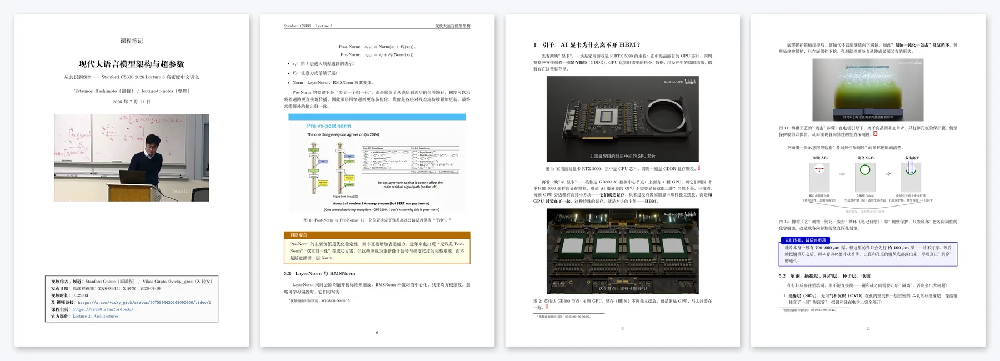
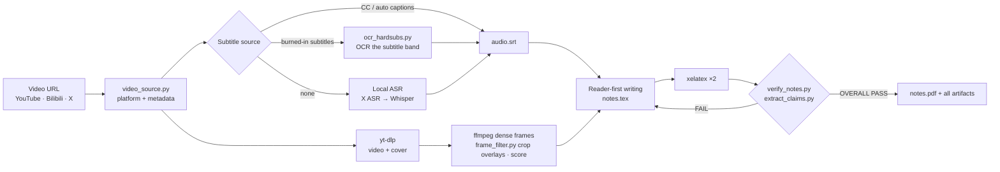
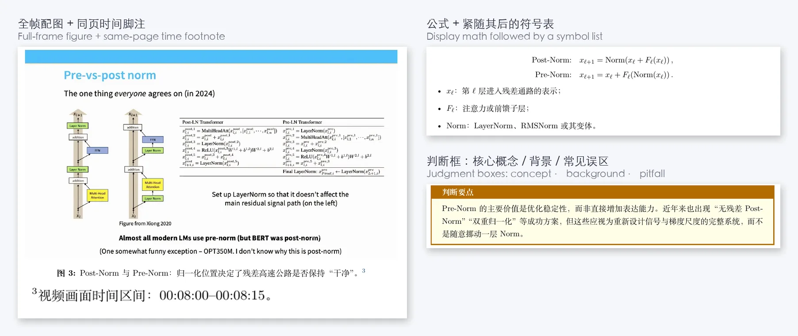
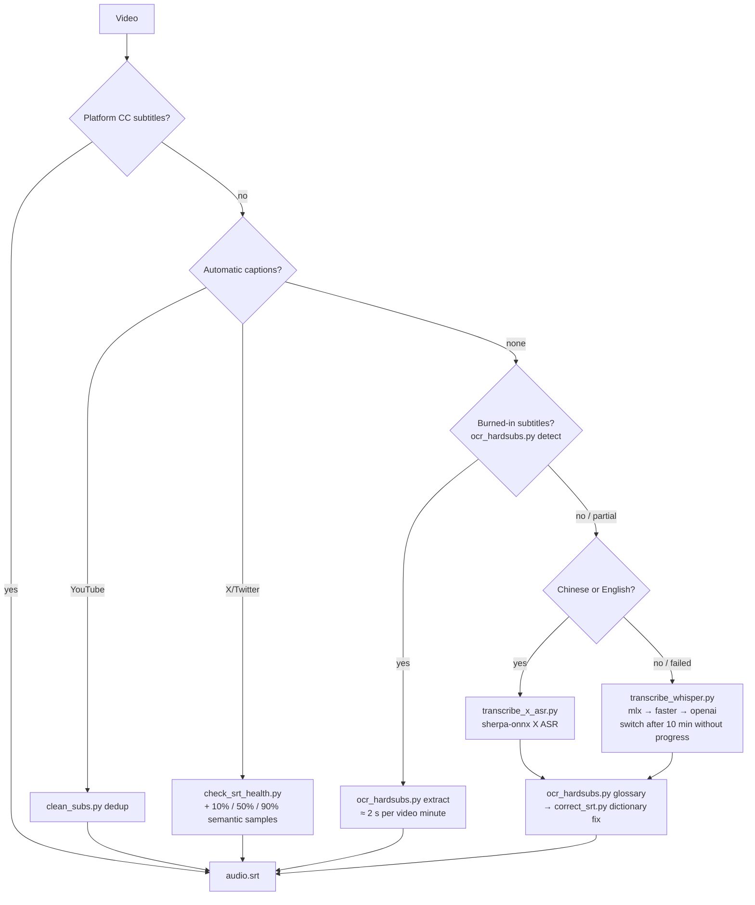

<div align="center">

# lecture-to-notes

**Turn a YouTube / Bilibili / X (Twitter) lecture video into a compilable Chinese LaTeX lecture-notes PDF.**
Reader-first prose, every figure footnoted with its source time range, every number traceable to the subtitles or the screen.

[](https://github.com/ysyecust/lecture-to-notes/actions/workflows/tests.yml)
[](https://github.com/ysyecust/lecture-to-notes/actions/workflows/pages.yml)
[](#dependencies)
[](LICENSE)

[**Browse the course library →**](https://blog.simona.plus/lecture-to-notes/) · [中文](README.md)



<sub>Left: cover and page 6 of Stanford CS336 Lecture 3 (“Modern LLM architectures and hyperparameters”); right: pages 3 and 11 of a Bilibili explainer on HBM memory. All generated by this tool.</sub>

</div>

## What it does

Give it a video URL and it produces a complete set of lecture notes: `notes.tex` (from `\documentclass` to `\end{document}`), the compiled `notes.pdf`, cropped figures, the final subtitle track, and a set of intermediate artifacts that make the content auditable (figure manifest, numerical-claim ledger, delivery-gate report). The repository is also a [Codex / Claude Code / DeepSeek Harness skill](#quick-start), a [course library site](#course-library-and-pdf-contributions), and a [paper-to-HTML tool](skills/paper-to-html/SKILL.md).



## What the output looks like



- **Teaching flow is rebuilt, not transcribed**: sections and subsections follow reader questions, every chapter ends with a summary, and the notes close with a synthesis section.
- **Every figure can be checked against the video**: a footnote under each figure gives the source time range (e.g. `00:08:00–00:08:15`), and the footnote is guaranteed to render on the same page.
- **Formulas come with symbol lists, numbers come with sources**: each display formula is followed by a symbol explanation; every number the lecture states is recorded in `numerical_claims.tsv` and checked against the notes.
- **Three kinds of judgment boxes**: core concept / background and trade-offs / common pitfalls — used only when a point needs to be separated from the main flow.

## Quick start

### Install the skill (DeepSeek Harness / Codex / Claude Code)

```bash
scripts/install_skill.sh            # → ~/.agents/skills (read by DeepSeek Harness and Codex agents)
scripts/install_skill.sh --claude   # → ~/.claude/skills
scripts/install_skill.sh --codex    # → ~/.codex/skills
scripts/install_skill.sh --all      # all three
```

The script copies `SKILL.md`, `references/`, `agents/`, the LaTeX template, and every helper under `scripts/` into `<root>/lecture-to-notes/assets/`, and writes `assets/INSTALLED_FROM` with the source commit. Re-running replaces the previous copy. Step 0 of SKILL.md checks each helper and stops on the first missing one instead of falling back to another skill. If an older command-style skill such as `source-command-*-render-pdf` lives in the same directory, move it out first, or the agent may load the wrong one.

Then trigger it in Claude Code with `/lecture-to-notes <URL>` (or paste a Bilibili / YouTube / X link — the skill is matched automatically).

### What one run produces

| File | Content |
|---|---|
| `notes.tex` / `notes.pdf` | Complete notes source and the two-pass `xelatex` output |
| `figures/` + `figure_manifest.tsv` + `figure_verification.txt` | Figures, the frame and time range behind each one, three-way verification output |
| `audio.srt` (plus `audio_corrected.srt`, `hardsub_ocr.srt`) | Final subtitle track and where it came from |
| `lecture_profile.json` · `teaching_atoms.tsv` · `numerical_claims.tsv` | Lecture mode and reader outcome, teaching-atom coverage, numerical-claim ledger |
| `bands.json` · `frame_scores.json` | Overlay geometry and candidate-frame scores (required when the model cannot see images) |
| `verify_notes.txt` | Delivery-gate report ending in `OVERALL PASS` |

## Features

| Capability | How | Script |
|---|---|---|
| Multi-platform | Detects YouTube, Bilibili (multi-part), and X/Twitter from the URL; probes metadata | `video_source.py` |
| Five-stage subtitle fallback | CC → auto captions (YouTube dedup, typically removes 50% duplicate lines) → burned-in subtitle OCR → local ASR → visual-only | `clean_subs.py` `check_srt_health.py` `ocr_hardsubs.py` `transcribe_x_asr.py` `transcribe_whisper.py` |
| Budgeted transcription | Whisper backend chosen per platform (mlx-whisper on Apple silicon); exits after 10 minutes without a single segment so the agent switches instead of waiting | `transcribe_whisper.py` |
| Fix speech with the picture | Aligns the OCR subtitle track with the ASR track and derives a correction glossary (刻石→刻蚀, 光眼膜→光掩膜) | `ocr_hardsubs.py glossary` → `correct_srt.py` |
| Dense frames + three-way check | One frame every 15 s plus contact-sheet review; every figure is checked frame × subtitle × caption before it enters LaTeX | `verify_figures.py` |
| Overlays and talking heads | Measures the navigation strip and subtitle band and crops only those; scores frames so presenter-only shots are rejected even when the model cannot see images | `frame_filter.py` |
| Traceable numbers | Extracts every number with a unit from subtitle and OCR tracks and checks each one against the notes | `extract_claims.py` |
| One-shot delivery gate | Density, mandatory artifacts, compile log, figure files, same-page footnotes — one command | `verify_notes.py` |
| Reader-first writing | A standalone writing reference: meaning before jargon, one job per paragraph, value before limits | [`references/reader-first-writing.md`](skills/lecture-to-notes/references/reader-first-writing.md) |
| Course library | Course spines, lecture ticks, full-text search, a dedicated reader; external contributions only through PDF-only pull requests | `site_catalog.py` `build_site.py` `pdf_inspector.py` |

## Subtitles: the five-stage fallback



**Two SRT correction passes**

- **Pass 1 — dictionary** (`correct_srt.py`): batch-replaces `wrong → right` pairs. The dictionary can come from `whisper_prompts/glossary_<course>.json` or be generated from burned-in subtitles by `ocr_hardsubs.py glossary`. Milliseconds.
- **Pass 2 — segment-level semantics** (`llm_correct_srt.py`): splits the track into ~90 s segments, picks one mid-segment frame each, and calls `claude -p` for multimodal correction. Fixes context-level errors but is slow; run it only for notes you intend to publish.

## Course library and PDF contributions

The site hosts course PDFs and paper notes: as of 2026-09-05, 7 courses, 62 lecture PDFs, about 1,990 pages, plus 9 paper notes — including all 18 lectures of Stanford CS336: Language Modeling from Scratch (Spring 2026) and the 2026 Nanjing University “Generative Software Engineering” course. From a course card, PDFs open in a dedicated reader page; when the embedded preview is unavailable, direct-open and download links remain.

Contributors cannot push to `main`. Fork the repository, add PDFs under `content/inbox/` in your fork, commit, and open a pull request with the PDF-contribution template. A pull request is a merge request only; it grants no write access.

Automation checks out the trusted base branch, starts an isolated container, validates the complete diff, and inspects the PDFs; only content merged by maintainers is deployed. Web and command-line steps and the PR fields are in [CONTRIBUTING.md](CONTRIBUTING.md) (Chinese).

The scanning envelope for external contributions is 25 MiB per PDF, 10 PDFs per PR, and 100 MiB in total. That bounds PR scanning, not the course library or maintainer releases.

## Source detection and probing

YouTube, Bilibili, and `https://x.com/<user>/status/<id>[/video/<n>]` (and the equivalent Twitter URLs) are supported. For X/Twitter the full input URL, including the optional `/video/<n>`, must be preserved.

```bash
python3 scripts/video_source.py detect "<URL>"
python3 scripts/video_source.py probe "<URL>"
```

Downloaded X/Twitter subtitles must pass the structural health check in `scripts/check_srt_health.py`, then a semantic spot-check against audio and picture at 10%, 50%, and 90% of the runtime; if any check fails, the pipeline switches to X audio → local ASR (X ASR for zh/en, Whisper fallback) → the SRT correction passes.

## Dependencies

### macOS

```bash
brew install yt-dlp ffmpeg imagemagick poppler
brew install --cask mactex        # xelatex + CTeX
pip install sherpa-onnx numpy      # optional: fast zh/en X ASR
pip install mlx-whisper            # Apple silicon: GPU Whisper, ~6 min for 61 min of audio
pip install rapidocr-onnxruntime Pillow numpy   # burned-in subtitle OCR + frame_filter.py
# Intel macs: pip install faster-whisper; openai-whisper is the last fallback
```

### Windows (winget, tested)

```powershell
pip install --user yt-dlp
winget install --id Gyan.FFmpeg -e --silent
winget install --id ImageMagick.ImageMagick -e --silent
winget install --id MiKTeX.MiKTeX -e --silent      # ~140 MB; installs ctex on first compile
pip install --user sherpa-onnx numpy               # optional: fast zh/en X ASR
pip install --user faster-whisper rapidocr-onnxruntime Pillow numpy
pip install --user openai-whisper                  # last fallback; pulls torch, ~2 GB
```

> MiKTeX asks before installing missing packages; pass `-enable-installer` to `xelatex` to let it download them. ffmpeg must be on PATH for every Whisper backend (otherwise `FileNotFoundError`).

### Linux (Debian / Ubuntu)

```bash
sudo apt install yt-dlp ffmpeg imagemagick poppler-utils texlive-xetex texlive-lang-chinese
pip install sherpa-onnx numpy  # optional
pip install faster-whisper rapidocr-onnxruntime Pillow numpy
```

### Tools at a glance

| Tool | Required | Purpose |
|------|:---:|------|
| `yt-dlp` | ✓ | Video / subtitle / metadata download |
| `ffmpeg` | ✓ | Frame and audio extraction; prerequisite for local ASR |
| `xelatex` | ✓ | LaTeX compilation (with ctex) |
| `magick` | ✓ | Contact sheets, frame handling |
| `pdftotext` | ✓ | Same-page footnote check in `verify_notes.py` (poppler) |
| `sherpa-onnx` + X ASR | △ | Fast local zh/en transcription; models cached outside Git |
| Whisper backend | △ | ASR fallback and other languages: `transcribe_whisper.py` picks `mlx-whisper` (macOS arm64) → `faster-whisper` → `openai-whisper` |
| `rapidocr-onnxruntime` | with burned-in subtitles | `ocr_hardsubs.py` reads the subtitle band and overlay geometry |
| `Pillow` + `numpy` | ✓ | `frame_filter.py` overlay crop and frame scores |
| `python3` | ✓ | Runs everything under `scripts/` (CI verifies 3.12 / 3.13) |
| `scripts/video_source.py` | ✓ | YouTube / Bilibili / X/Twitter URL detection and metadata probe |
| `scripts/check_srt_health.py` | X/Twitter subtitles | SRT coverage, duplication, and runtime-window checks |
| Claude Code CLI | △ | Only for `llm_correct_srt.py` (reuses your local login, no API key) |

## Tests and CI

```bash
PYTHONPATH=. python3 -m unittest discover -s tests -v   # exactly what CI runs
```

`.github/workflows/tests.yml` runs two gate jobs on pull requests and pushes to `main`: `unit` (every Python test; needs zsh, numpy, Pillow) and `template` (compiles `notes-template.tex` inside TeX Live with CJK support, covering every template macro). Two slow jobs run only on manual dispatch or the weekly schedule: `synthetic-video` renders a deterministic lecture video with Pillow — burned-in subtitles, a static navigation strip, a presenter block — and runs the real `ocr_hardsubs.py` and `frame_filter.py` pipeline against it; `macos-smoke` runs the suite on an Apple-silicon runner and checks that `transcribe_whisper.py` selects mlx. Tests that need optional tools (xelatex, ffmpeg, rapidocr, a CJK font) skip when the tool is absent. `main` requires `unit` and `template` to pass before merging.

## Repository layout

<details>
<summary>Expand</summary>

```text
.
├── README.md / README.en.md
├── CONTRIBUTING.md             # PDF-only PR guide (Chinese)
├── LICENSE
├── content/
│   ├── courses/                # course manifests and published PDFs
│   ├── inbox/                  # community PDF contribution inbox
│   └── papers.json             # paper-notes catalog
├── ci/
│   └── pdf-sandbox.Dockerfile  # PDF inspection and site build sandbox
├── scripts/
│   ├── video_source.py        # YouTube / Bilibili / X URL detection and metadata probe
│   ├── check_srt_health.py    # X/Twitter SRT structural health check
│   ├── clean_subs.py          # YouTube auto-caption dedup
│   ├── transcribe_x_asr.py    # optional zh/en X ASR (sherpa-onnx) with SRT timestamps
│   ├── correct_srt.py         # dictionary-level SRT fix (fast, data-driven)
│   ├── llm_correct_srt.py     # segment-level SRT fix (LLM + multimodal, slow)
│   ├── verify_figures.py      # three-way figure check (timestamp × subtitle × frame)
│   ├── transcribe_whisper.py  # Whisper with per-platform backend selection and a no-progress budget
│   ├── ocr_hardsubs.py        # burned-in subtitle OCR: detect / extract to SRT / overlay geometry / glossary
│   ├── frame_filter.py        # navigation-strip and subtitle-band crop; talking-head scores
│   ├── extract_claims.py      # numerical-claim ledger from subtitle/OCR tracks, checked against the notes
│   ├── verify_notes.py        # one-shot delivery gate: density, artifacts, compile log, figures, footnotes
│   ├── install_skill.sh       # install the skill into ~/.agents / ~/.claude / ~/.codex
│   ├── prepare_cover.sh       # cover conversion (webp/png → jpg)
│   ├── smart_crop.py          # slide-region detector (experimental; production uses full frames)
│   ├── pdf_inspector.py        # PDF safety inspection, metadata, first-page preview
│   ├── site_catalog.py         # trusted course catalog
│   ├── build_site.py           # static site build
│   └── whisper_prompts/        # Whisper --initial_prompt glossaries
├── tests/                      # unittest suite; synthetic_video.py renders the synthetic lecture
├── docs/
│   ├── index.html              # course library home
│   ├── reader.html             # allowlist-driven PDF reader
│   ├── contribute.html         # PDF contribution entry
│   ├── assets/                 # framework-free front-end modules and styles; readme/ holds this file's images
│   └── papers/                 # published paper notes (HTML)
├── .github/workflows/
│   ├── tests.yml               # PR gate + weekly slow tests
│   ├── pages.yml               # site build and deploy
│   └── contribution-check.yml  # sandboxed PDF contribution check
└── skills/
    ├── lecture-to-notes/
    │   ├── SKILL.md            # skill definition (Codex / Claude Code / DeepSeek Harness)
    │   ├── agents/
    │   │   └── openai.yaml     # agent UI metadata
    │   ├── references/
    │   │   └── reader-first-writing.md  # reader-first writing rules
    │   └── assets/
    │       └── notes-template.tex  # LaTeX template (\vtag \srcnote \degC \um \nm \angstrom)
    ├── lecture-to-md/          # Markdown-notes sub-workflow (local ASR)
    └── paper-to-html/          # paper → self-contained HTML notes
```

</details>

## Compared with existing tools

| Feature | [llm-note-generator](https://github.com/Stefan0219/llm-note-generator) | [wdkns-skills](https://github.com/wdkns/wdkns-skills) | **lecture-to-notes** |
|------|:---:|:---:|:---:|
| Fully automatic (no prompt pasting) | ✗ | ✓ | ✓ |
| Bilibili | ✗ | ✗ | ✓ |
| X/Twitter | ✗ | ✗ | ✓ |
| Subtitle fallback (hard-sub OCR / X ASR / Whisper) | ✗ | ✗ | ✓ |
| Multi-part videos | ✗ | ✗ | ✓ |
| Contact-sheet frame review | ✗ | ✓ | ✓ |
| Time-provenance footnotes | ✗ | ✓ | ✓ |
| Per-number claim check | ✗ | ✗ | ✓ |
| Delivery gate (compile log / same-page footnotes / density) | ✗ | ✗ | ✓ |
| Dense judgment-box system | ✓ | ✓ | ✓ |

## Use cases

- Notes for university open courses (Nanjing University, MIT OCW, Stanford CS, …)
- Turning technical talks and conference sessions into structured documents
- Knowledge extraction and archiving from YouTube / Bilibili / X/Twitter teaching videos

## Acknowledgements

Inspired by:

- [Stefan0219/llm-note-generator](https://github.com/Stefan0219/llm-note-generator) — the original PDF + subtitles → prompt idea
- [wdkns/wdkns-skills](https://github.com/wdkns/wdkns-skills) — the Codex-skill design for YouTube → LaTeX

## License

GPL-3.0, matching the upstream projects.
