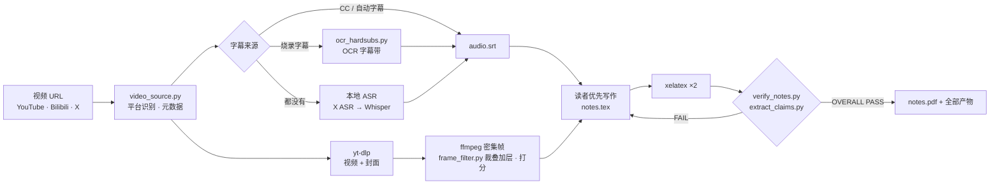
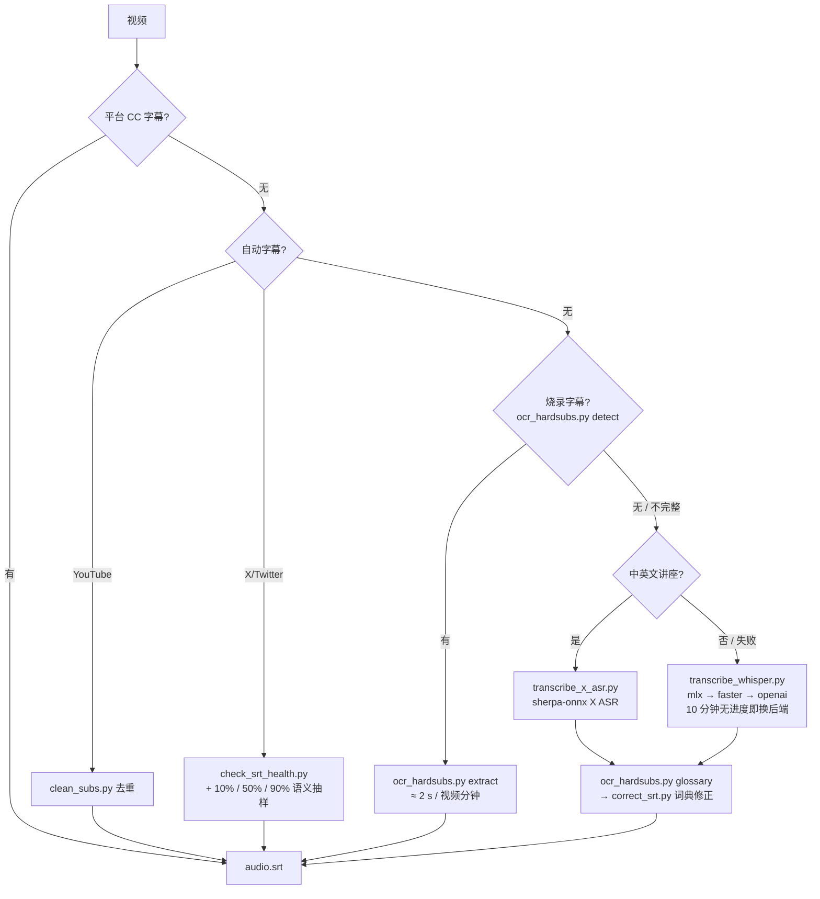

<div align="center">

# lecture-to-notes

**把 YouTube / Bilibili / X(Twitter) 的讲座视频，变成可编译的中文 LaTeX 讲义 PDF。**
读者优先的成文，每张配图带原视频时间脚注，每个数字都能追溯到字幕或画面。

[](https://github.com/ysyecust/lecture-to-notes/actions/workflows/tests.yml)
[](https://github.com/ysyecust/lecture-to-notes/actions/workflows/pages.yml)
[](#依赖)
[](LICENSE)

[**在线课程库 →**](https://blog.simona.plus/lecture-to-notes/) · [English](README.en.md)


<sub>左：Stanford CS336 Lecture 3《现代大语言模型架构与超参数》封面与第 6 页；右：B 站科普《HBM 高带宽内存的原理与制造》第 3、11 页。全部由本工具生成。</sub>

</div>

## 它做什么

给一个视频链接，产出一套完整的讲义：`notes.tex`（从 `\documentclass` 到 `\end{document}`）、编译好的 `notes.pdf`、裁好的配图、最终字幕轨，以及一组能证明内容可信的中间产物（配图清单、数值主张核对表、交付门禁报告）。仓库同时是一个 [Codex / Claude Code / DeepSeek Harness skill](#快速开始)、一个 [课程资料库站点](#课程资料库与贡献-pdf) 和一个 [论文解读工具](skills/paper-to-html/SKILL.md)。



## 成品长什么样


- **重构教学流，不照搬字幕顺序**：按读者问题组织 `\section` / `\subsection`，每章以「本章小结」收尾，末尾有「总结与延伸」。
- **每张配图都能回看**：配图下方脚注给出原视频的画面时间区间（如 `00:08:00–00:08:15`），配图与脚注保证在同一页。
- **公式有符号表，数字有出处**：display math 后紧跟符号解释；讲座里出现的每个数值都记入 `numerical_claims.tsv` 并核对。
- **三种判断框**：核心概念 / 背景与权衡 / 常见误区，只在确实需要从正文里分离时使用。

## 快速开始

### 安装 Skill（DeepSeek Harness / Codex / Claude Code）

```bash
scripts/install_skill.sh            # → ~/.agents/skills（DeepSeek Harness 与 Codex agents 读取此目录）
scripts/install_skill.sh --claude   # → ~/.claude/skills
scripts/install_skill.sh --codex    # → ~/.codex/skills
scripts/install_skill.sh --all      # 三处都装
```

脚本把 `SKILL.md`、`references/`、`agents/`、LaTeX 模板和 `scripts/` 下全部辅助脚本复制到
`<root>/lecture-to-notes/assets/`，并写入 `assets/INSTALLED_FROM` 记录来源 commit；重复运行会整体替换旧副本。
SKILL.md 的第 0 步会逐个检查这些辅助脚本，缺任何一个就停止，不会退回到别的 skill。
如果同一目录下还留着旧的 `source-command-*-render-pdf` 之类命令式 skill，先移走，否则 agent 可能加载错的那个。

然后在 Claude Code 中使用 `/lecture-to-notes <URL>` 触发（或直接贴一个 B 站 / YouTube / X(Twitter) 链接，skill 会被自动匹配）。

### 一次运行会得到什么

| 文件 | 内容 |
|---|---|
| `notes.tex` / `notes.pdf` | 完整讲义源码与两遍 `xelatex` 编译结果 |
| `figures/` + `figure_manifest.tsv` + `figure_verification.txt` | 配图、每图的帧与时间区间、三方校验输出 |
| `audio.srt`（及 `audio_corrected.srt`、`hardsub_ocr.srt`） | 最终字幕轨与其来源 |
| `lecture_profile.json` · `teaching_atoms.tsv` · `numerical_claims.tsv` | 讲座类型与读者目标、教学原子覆盖表、数值主张核对表 |
| `bands.json` · `frame_scores.json` | 叠加层几何、候选帧打分（无视觉模型时必需） |
| `verify_notes.txt` | 交付门禁报告，末行 `OVERALL PASS` |

## 特性

| 能力 | 做法 | 脚本 |
|---|---|---|
| 多平台 | 从 URL 识别 YouTube、Bilibili（含分 P）和 X/Twitter，探测元数据 | `video_source.py` |
| 字幕五级回退 | CC → 自动字幕（YouTube 去重，通常去掉 50% 重复行）→ 烧录字幕 OCR → 本地 ASR → 纯视觉 | `clean_subs.py` `check_srt_health.py` `ocr_hardsubs.py` `transcribe_x_asr.py` `transcribe_whisper.py` |
| 转写有预算 | Whisper 后端按平台自动选（Apple silicon 用 mlx-whisper），10 分钟无一个 segment 就退出换后端，不再盲等 | `transcribe_whisper.py` |
| 用画面纠正听写 | 对齐 OCR 字幕与 ASR 轨，自动生成 `刻石→刻蚀`、`光眼膜→光掩膜` 这类纠错词典 | `ocr_hardsubs.py glossary` → `correct_srt.py` |
| 密集帧 + 三方验证 | 每 15 秒采样 + contact sheet 审查；每张配图写入前核对「帧画面 × 字幕 × 描述」 | `verify_figures.py` |
| 叠加层与讲者帧 | 测出导航条、字幕带并只裁掉它们；给帧打分，模型看不到图时也能拒绝讲者出镜帧 | `frame_filter.py` |
| 数值可追溯 | 从字幕和 OCR 轨提取每个带单位的数字，逐条核对讲义 | `extract_claims.py` |
| 一次性交付门禁 | 密度、必需产物、编译日志、配图文件、脚注同页，一条命令 | `verify_notes.py` |
| 读者优先写作 | 独立的写作规范：先讲含义再给术语、段落一个任务、限制先讲价值 | [`references/reader-first-writing.md`](skills/lecture-to-notes/references/reader-first-writing.md) |
| 课程化归档 | 课程书脊、讲次刻度、全文检索、独立阅读页；外部只能通过 PDF-only PR 投稿 | `site_catalog.py` `build_site.py` `pdf_inspector.py` |

## 字幕获取：五级回退



**SRT 修正两阶段**

- **阶段 1 — 词典级**（`correct_srt.py`）：用 `wrong → right` pair 批量替换。词典可以来自 `whisper_prompts/glossary_<course>.json`，也可以由 `ocr_hardsubs.py glossary` 从烧录字幕自动生成。毫秒完成。
- **阶段 2 — 段级语义**（`llm_correct_srt.py`）：按 ~90 秒切段，每段抽一个中间帧，调 `claude -p` 做多模态校准。能修语境级错误，但耗时长，一般只对要发布的讲义跑。

## 课程资料库与贡献 PDF

课程站点收录多门课程的 PDF 和论文解读：截至 2026-09-05 共 7 门课程、62 篇讲义、约 1990 页，另有 9 篇论文解读，包括 Stanford
CS336: Language Modeling from Scratch Spring 2026 全 18 讲，
以及南京大学《生成式软件工程》2026 课程讲义。
课程卡片进入讲次列表后，PDF 会在独立阅读页中打开；若浏览器内嵌预览不可用，仍可
直接打开或下载原始 PDF。

普通贡献者不能直接修改本仓库的 `main` 分支。他们需要先 Fork 仓库，在自己的
Fork 中把 PDF 添加到 `content/inbox/` 并保存 commit，再使用 PDF contribution
模板向本仓库提交 PR。PR 只是一份合并申请，不会让贡献者获得写入权限。

自动化会从可信基础分支启动隔离容器，验证完整提交差异并解析 PDF；只有维护者
合并后的内容才会部署。网页步骤、命令行步骤和 PR 字段见
[CONTRIBUTING.md](CONTRIBUTING.md)。

外部投稿的安全容量边界是：单个 PDF 不超过 25 MiB、每个 PR 不超过 10 个 PDF、
合计不超过 100 MiB。这只是 PR 扫描范围，不是课程库或维护者发布的开发上限。

## 视频源检测与探测

支持 YouTube、Bilibili，以及 `https://x.com/<user>/status/<id>[/video/<n>]` 和对应的
Twitter URL。对 X/Twitter 必须保留用户输入的完整 URL，包括可选的 `/video/<n>`。

```bash
python3 scripts/video_source.py detect "<URL>"
python3 scripts/video_source.py probe "<URL>"
```

下载到的 X/Twitter 字幕必须先通过 `scripts/check_srt_health.py` 的结构健康检查，
再在视频时长 10%、50%、90% 三处对照音频和画面做语义抽样；任一检查失败时，改用
X 音频 → 本地 ASR（中英优先 X ASR，Whisper 回退）→ 现有 SRT 修正流程。

## 依赖

### macOS

```bash
brew install yt-dlp ffmpeg imagemagick poppler
brew install --cask mactex        # 含 xelatex + CTeX 中文支持
pip install sherpa-onnx numpy      # 可选：X ASR 中英混合快速转写
pip install mlx-whisper            # Apple silicon：Whisper GPU 转写，61 分钟音频约 6 分钟
pip install rapidocr-onnxruntime Pillow numpy   # 烧录字幕 OCR + frame_filter.py
# 非 Apple silicon 的 mac 用 pip install faster-whisper；openai-whisper 只作最后回退
```

### Windows（winget，已实测通过）

```powershell
pip install --user yt-dlp
winget install --id Gyan.FFmpeg -e --silent
winget install --id ImageMagick.ImageMagick -e --silent
winget install --id MiKTeX.MiKTeX -e --silent      # ~140 MB，首次编译会自动装 ctex
pip install --user sherpa-onnx numpy               # 可选：X ASR 中英混合快速转写
pip install --user faster-whisper rapidocr-onnxruntime Pillow numpy
pip install --user openai-whisper                  # 最后回退；会一起装 torch，~2 GB
```

> 注意：MiKTeX 默认需要对缺失宏包手动放行；命令行调用 `xelatex` 时加 `-enable-installer` 让它自动下。Whisper 依赖的 ffmpeg 需要在 PATH 中（否则跑 Whisper 时会 `FileNotFoundError`）。

### Linux（Debian / Ubuntu 参考）

```bash
sudo apt install yt-dlp ffmpeg imagemagick poppler-utils texlive-xetex texlive-lang-chinese
pip install sherpa-onnx numpy  # 可选
pip install faster-whisper rapidocr-onnxruntime Pillow numpy
```

### 工具一览

| 工具 | 必需 | 用途 |
|------|:---:|------|
| `yt-dlp` | ✓ | 视频 / 字幕 / 元数据下载 |
| `ffmpeg` | ✓ | 帧提取、音频提取、本地 ASR 前置 |
| `xelatex` | ✓ | LaTeX 编译（含 ctex 宏包） |
| `magick` | ✓ | Contact sheet、帧处理 |
| `pdftotext` | ✓ | `verify_notes.py` 的脚注同页检查（poppler） |
| `sherpa-onnx` + X ASR | △ | 中英混合快速本地转写；模型单独缓存，不进 Git |
| Whisper 后端 | △ | ASR 回退及其他语言：`transcribe_whisper.py` 自动选 `mlx-whisper`（macOS arm64）→ `faster-whisper` → `openai-whisper` |
| `rapidocr-onnxruntime` | 有烧录字幕时 | `ocr_hardsubs.py` 读字幕带和叠加层几何 |
| `Pillow` + `numpy` | ✓ | `frame_filter.py` 裁剪叠加层、给帧打分 |
| `python3` | ✓ | 运行 `scripts/` 下所有脚本（CI 在 3.12 / 3.13 上验证） |
| `scripts/video_source.py` | ✓ | YouTube / Bilibili / X/Twitter URL 识别与元数据探测 |
| `scripts/check_srt_health.py` | X/Twitter 字幕 | 检查 SRT 覆盖率、重复率和运行时窗口 |
| Claude Code CLI | △ | 仅 `llm_correct_srt.py` 需要（复用本地登录态，无需 API key） |

## 测试与 CI

```bash
PYTHONPATH=. python3 -m unittest discover -s tests -v   # 与 CI 完全相同的命令
```

`.github/workflows/tests.yml` 在 PR 和 `main` 推送时运行两个门禁 job：`unit`（全部 Python 测试，需要 zsh、numpy、Pillow）和 `template`（在带 CJK 支持的 TeX Live 里编译 `notes-template.tex`，覆盖所有模板宏）。两个慢 job 只在手动触发或每周一定时运行：`synthetic-video` 用 Pillow 渲染一段带烧录字幕、静态导航条和讲者色块的合成视频，真实跑一遍 `ocr_hardsubs.py` 与 `frame_filter.py`；`macos-smoke` 在 Apple silicon runner 上跑全部测试并确认 `transcribe_whisper.py` 选中 mlx 后端。缺少可选依赖（xelatex、ffmpeg、rapidocr、CJK 字体）时对应测试自动跳过，本地不会因此报错。`main` 分支要求 `unit` 和 `template` 通过后才能合并。

## 仓库结构

<details>
<summary>展开目录树</summary>

```text
.
├── README.md / README.en.md
├── CONTRIBUTING.md             # PDF-only PR 投稿说明
├── LICENSE
├── content/
│   ├── courses/                # 课程 manifest 与已发布 PDF
│   ├── inbox/                  # 社区 PDF 投稿入口
│   └── papers.json             # 论文解读目录
├── ci/
│   └── pdf-sandbox.Dockerfile  # PDF 检查与站点构建沙箱
├── scripts/
│   ├── video_source.py        # YouTube / Bilibili / X(Twitter) URL 识别与元数据探测
│   ├── check_srt_health.py    # X/Twitter 字幕结构健康检查
│   ├── clean_subs.py          # YouTube 自动字幕去重
│   ├── transcribe_x_asr.py    # 可选 X ASR 中英混合本地转写与 SRT 时间戳
│   ├── correct_srt.py         # Whisper SRT 词典级修正（数据驱动，快）
│   ├── llm_correct_srt.py     # Whisper SRT 段级修正（LLM + 多模态，慢但更准）
│   ├── verify_figures.py      # 图文三方验证（时间戳 × 字幕 × 画面）
│   ├── transcribe_whisper.py  # Whisper 转写：按平台选 mlx / faster / openai 后端 + 无进度预算
│   ├── ocr_hardsubs.py        # 烧录字幕 OCR：检测 / 抽取为 SRT / 叠加层几何 / Whisper 纠错词典
│   ├── frame_filter.py        # 导航条、字幕带测量与裁剪；讲者出镜帧打分
│   ├── extract_claims.py      # 从字幕 / OCR 提取数值主张并核对讲义
│   ├── verify_notes.py        # 交付前一次性门禁：密度、产物、编译日志、配图与脚注同页
│   ├── install_skill.sh       # 安装 skill 到 ~/.agents / ~/.claude / ~/.codex
│   ├── prepare_cover.sh       # 封面格式转换（webp/png → jpg）
│   ├── smart_crop.py          # 课件区域检测（实验性，实际流程中通常直接用全帧）
│   ├── pdf_inspector.py        # PDF 安全检查、元数据与首图解析
│   ├── site_catalog.py         # 生成可信课程目录
│   ├── build_site.py           # 构建静态站点
│   └── whisper_prompts/        # Whisper --initial_prompt 术语表
├── tests/                      # unittest 套件；synthetic_video.py 生成合成讲座视频
├── docs/
│   ├── index.html              # 课程资料首页
│   ├── reader.html             # 目录白名单驱动的 PDF 阅读器
│   ├── contribute.html         # PDF 贡献入口
│   ├── assets/                 # 无框架前端模块与样式；readme/ 下是本文件的插图
│   └── papers/                 # 已发布的论文解读 HTML
├── .github/workflows/
│   ├── tests.yml               # PR 门禁 + 每周慢测
│   ├── pages.yml               # 站点构建与部署
│   └── contribution-check.yml  # PDF 投稿沙箱检查
└── skills/
    ├── lecture-to-notes/
    │   ├── SKILL.md            # Skill 主定义（适用于 Codex / Claude Code / DeepSeek Harness）
    │   ├── agents/
    │   │   └── openai.yaml     # Agent UI 元数据
    │   ├── references/
    │   │   └── reader-first-writing.md  # 读者优先写作规则
    │   └── assets/
    │       └── notes-template.tex  # LaTeX 模板（含 \vtag \srcnote \degC \um \nm \angstrom）
    ├── lecture-to-md/          # Markdown 笔记子工作流（本地 ASR）
    └── paper-to-html/          # 论文 → 自包含 HTML 解读
```

</details>

## 相比现有工具的改进

| 特性 | [llm-note-generator](https://github.com/Stefan0219/llm-note-generator) | [wdkns-skills](https://github.com/wdkns/wdkns-skills) | **lecture-to-notes** |
|------|:---:|:---:|:---:|
| 全自动（无需手动粘贴 prompt） | ✗ | ✓ | ✓ |
| Bilibili 支持 | ✗ | ✗ | ✓ |
| X/Twitter 支持 | ✗ | ✗ | ✓ |
| 字幕回退（烧录字幕 OCR / X ASR / Whisper） | ✗ | ✗ | ✓ |
| 分P视频处理 | ✗ | ✗ | ✓ |
| Contact sheet 帧审查 | ✗ | ✓ | ✓ |
| 时间溯源脚注 | ✗ | ✓ | ✓ |
| 数值主张逐条核对 | ✗ | ✗ | ✓ |
| 交付门禁（编译日志 / 脚注同页 / 密度） | ✗ | ✗ | ✓ |
| 高信息密度 box 系统 | ✓ | ✓ | ✓ |

## 适用场景

- 大学公开课笔记整理（南京大学、MIT OCW、Stanford CS 等）
- 技术讲座 / 会议 talk 转结构化文档
- YouTube / Bilibili / X/Twitter 教学视频的知识提取与归档

## 致谢

本项目受以下开源工作启发：

- [Stefan0219/llm-note-generator](https://github.com/Stefan0219/llm-note-generator) — PDF+字幕→prompt 的原始思路
- [wdkns/wdkns-skills](https://github.com/wdkns/wdkns-skills) — YouTube 视频转 LaTeX 的 Codex skill 设计

## License

GPL-3.0 — 与上游项目保持一致。
